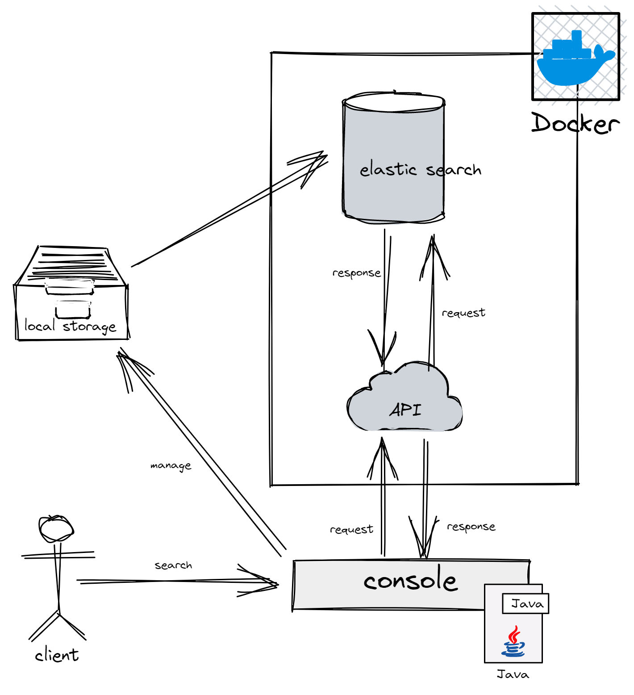
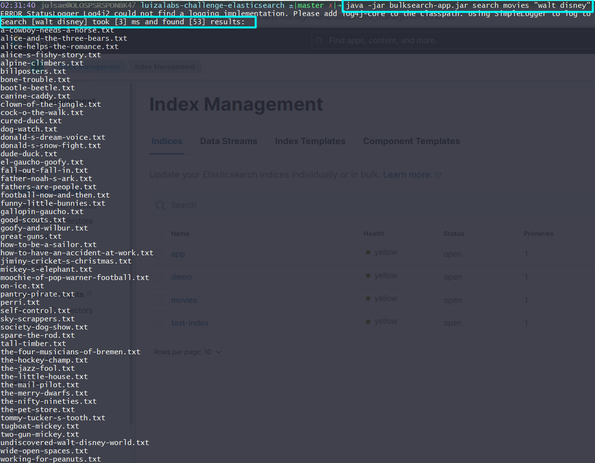

# Search Tool

## Challenge

Develop a tool that allows searching for a keyword in a set of +11,800 text files.

## Requirements

- Coverage of unit tests.
- Versioned code.
- Documentation to execute the code tool.
- The keyword search does not have a logical order.
- When a keyword is composed, the search criteria must be `AND`.
- Process executed up to 1ms.
- The set of files can be pre-processed.

---

## Architecture



## Project structure

```bash
```

## Initial considerations

The developed tool has a structure to be executed and the allowed commands are described below:

| **Option** | **First Argument** | **Second Argument** | **Example** | **Consider** |
|:---:|:---:|:---:|:---:|:---:|
| upload | index-name | path | upload my-index "./data" | the second argument must be contained in double quotes |
| search | index-name | keyword | search my-index "walt disney" | the index-name must be the same that was used to upload the files |
| native-search | index-name | keyword | native-search my-index "julian" | the index-name must be the same that was used to upload the files |

## How to prepare the environment?

### ***Step 01***

Run the `docker-compose.yml` file with the command:

```powershell
docker-compose up -d
```

We can now access ***ElasticSearch*** and ***Kibana*** instances at `http://localhost:9200` and `http://localhost:5601` respectively.

### ***Step 02***

Populate the ElasticSearch instance with information from the text files found in the `./data`.

This process can be executed through the tool with the command:

```bash
java -jar bulksearch-app.jar upload <index-name> "./data"
```

Don't forget to remove the **'<>'** characters and change to the correct index.

## How to run a search?

You have two options to perform a search:

### ***Option 01***

Run the next command to search with [Elasticsearch Java API Client](https://www.elastic.co/guide/en/elasticsearch/client/java-api-client/current/index.html)

```bash
java -jar bulksearch-app.jar search <index-name> "walt disney"
```

### ***Option 02***

Run the next command to search with Rest native request

```bash
java -jar bulksearch-app.jar native-search <index-name> "walt disney"
```

The result for both queries will have the same result, the only difference is the response speed.

Result with `search` option



Result with `native-search` option

